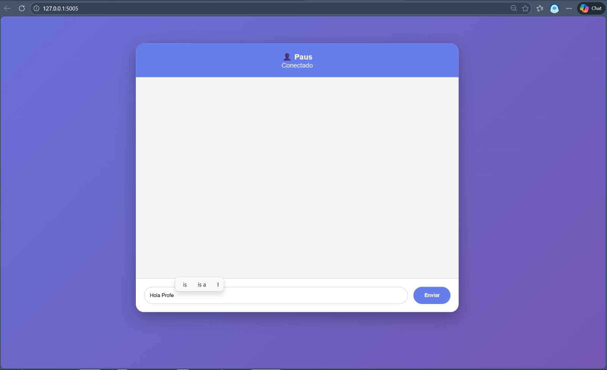
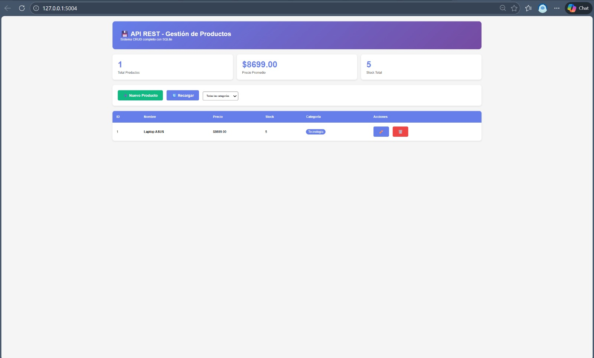
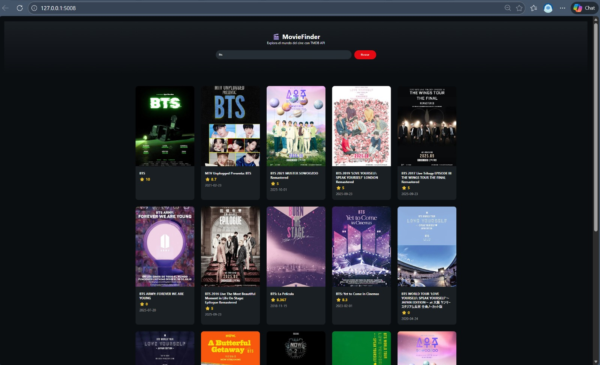
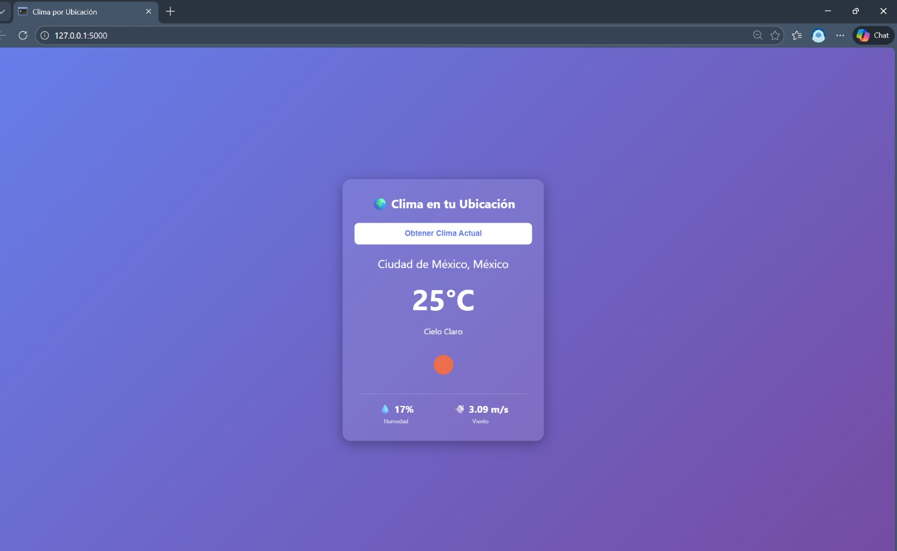
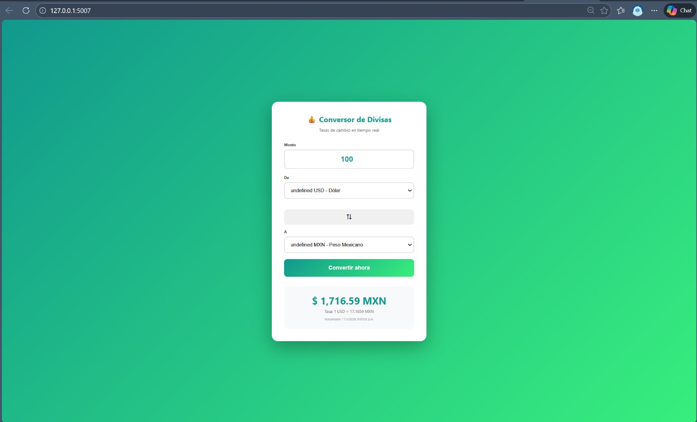
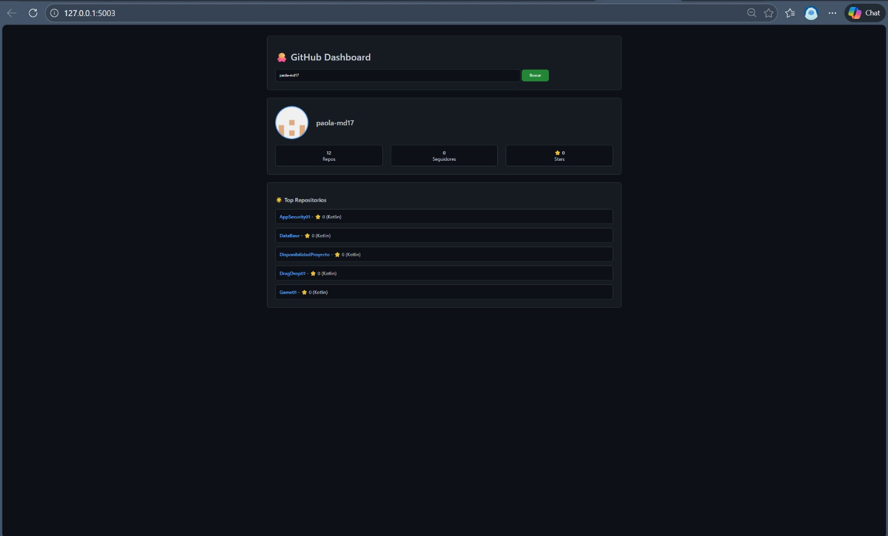
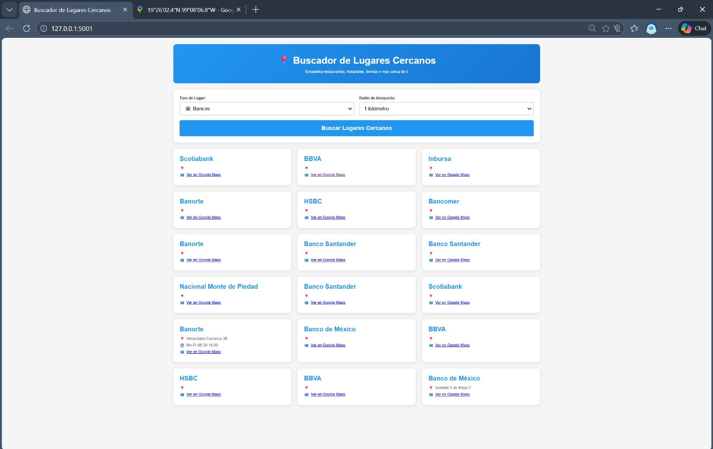
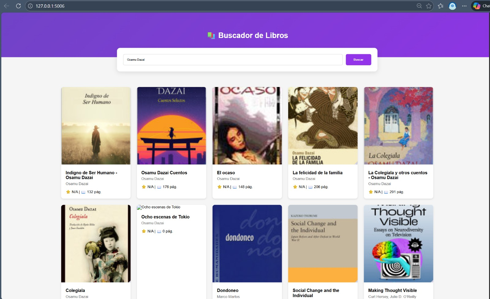
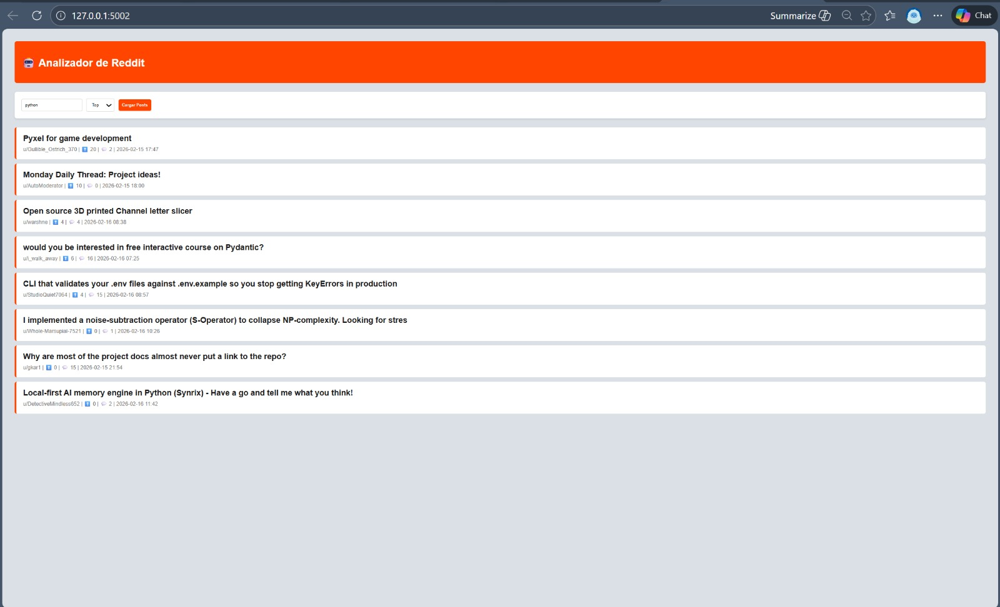

# Apis-con-Python-Flask.-
Practica paginas web implementando apis con Python Flask. 

# 🚀 EJERCICIOS-APIS - Master Portfolio Flask 2026

Este repositorio contiene una colección robusta de **10 microservicios funcionales** desarrollados con Python y Flask. El proyecto demuestra el dominio en el consumo de APIs REST de terceros, persistencia de datos (SQL/NoSQL) y el desarrollo de interfaces dinámicas asíncronas utilizando JavaScript (Fetch API).

## 🚀 Características Principales
* **🌐 Ecosistema de APIs:** Integración con Spotify, TMDb, GitHub, Reddit y Google Books.
* **💾 Persistencia Dual:** Gestión de datos locales con **SQLite** y en la nube con **Firebase Realtime Database**.
* **⚡ Interfaces Asíncronas:** Uso extensivo de **Fetch API** para actualizaciones en tiempo real sin recarga de página.
* **📂 Arquitectura Modular:** Gestión de puertos independientes para cada aplicación (5000-5009).

## 🛠 Stack Tecnológico
| Categoría | Tecnología |
| :--- | :--- |
| **Lenguaje** | Python 3.12+ |
| **Framework** | Flask (Backend) |
| **Bases de Datos** | SQLite & Firebase |
| **UI** | HTML5 / CSS3 / JS (ES6+) |

## 📂 Estructura del Proyecto
```text
EJERCICIOS-APIS/
├── 📂 static/            # Recursos estáticos (CSS, JS e Imágenes)
│   └── 📂 img/           # Capturas de pantalla (.jpeg)
├── 📂 templates/         # Vistas dinámicas (Plantillas HTML)
├── 📂 venv/              # Entorno virtual de Python
├── 📄 productos.db       # Base de datos relacional local
└── 📄 requirements.txt   # Dependencias del proyecto

```

## 📸 Capturas de Pantalla

| Chat Realtime | Spotify Search | CRUD Productos |
|:---:|:---:|:---:|
|  |  |  |

| Películas | Clima | Divisas |
|:---:|:---:|:---:|
|  |  |  |

| GitHub | Lugares | Libros |
|:---:|:---:|:---:|
|  |  |  |

| Reddit | | |
|:---:|:---:|:---:|
|  | | |


## 📂 ANEXO: Código Fuente Completo
A continuación se adjunta el código fuente de los archivos principales de las APIS para su revisión directa en este documento.

<details>
<summary><b>CLICK AQUÍ para ver: Chat_app.py</b></summary>

```


```
